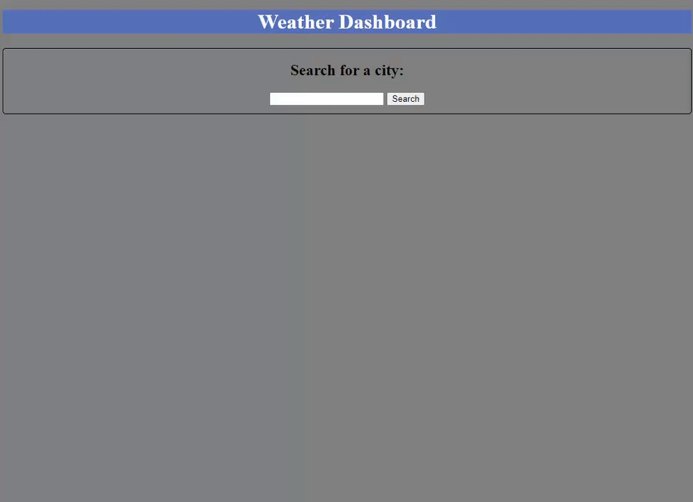

# Weather-Dashboard

## Description

This application is a simple weather dashboard that allows users to view the current weather and 5-day forecast for a desired location.

## Visuals

## Usage

The purpose of this application is to provide users with a quick and easy method to check the weather in any desired location.

## URL

https://steveb175.github.io/Weather-Dashboard/

## License

Please refer to the LICENSE in the repo.
